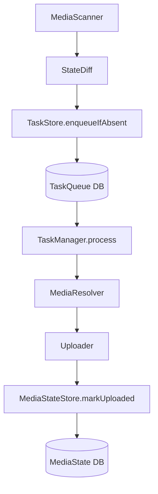

# media_watch_tasks

Flutter에서 **로컬 사진(Android/iOS) 신규 파일만 감지**하고, 업로드를 **Task Queue로 안전하게 관리**하기 위한 유틸리티 패키지입니다.

- **OS 실시간 이벤트 의존 없음**: 주기적 스캔 + DB 상태 비교
- **중복 업로드 방지**: `assetId` 기반(기본) + SHA-256 해시 기반(옵션)
- **백그라운드 안전 실행**: `background_fetch` 트리거 + DB 기반 재시도

## 아키텍처



## 작동 원리

### 1. 신규 사진 감지 (스캔 단계)

1. **`PhotoManagerMediaScanner`**가 로컬 사진 라이브러리를 스캔하여 모든 사진의 `assetId`와 `createdAt`을 수집합니다.
2. **`DriftMediaStateStore`**에서 이전에 본 사진 목록을 조회합니다.
3. DB에 없는 `assetId`만 필터링하여 **신규 사진**으로 판단합니다.
4. 신규 사진들을 **`DriftTaskStore`**에 `pending` 상태로 등록합니다.

### 2. 업로드 처리 (처리 단계)

1. **`TaskManager.process()`**가 `pending` 상태의 작업들을 배치로 가져옵니다(동시 실행 방지를 위한 lock 메커니즘 포함).
2. 각 작업에 대해 **`PhotoManagerMediaResolver`**가 `assetId`를 실제 파일 데이터로 변환합니다.
3. **`Uploader`**가 파일을 백엔드로 업로드합니다.
4. 업로드 성공 시:
   - **`DriftTaskStore`**에서 작업 상태를 `success`로 변경
   - **`DriftMediaStateStore`**에서 해당 미디어를 `uploaded=true`로 마킹
5. 업로드 실패 시:
   - **`DriftTaskStore`**에서 작업 상태를 `failed`로 변경하고 재시도 스케줄 설정(지수 백오프)

## 설치

`pubspec.yaml`:

```yaml
dependencies:
  media_watch_tasks:
    path: ../media_watch_tasks
```

## 주요 클래스 설명

### 핵심 컴포넌트

- **`MediaWatchDatabase`**: Drift 기반 SQLite 데이터베이스 인스턴스. 미디어 상태와 업로드 작업 큐를 저장합니다.
- **`TaskManager`**: 전체 업로드 프로세스를 오케스트레이션하는 핵심 클래스. 스캔 → 큐 등록 → 처리 흐름을 관리합니다.

### 스캔 및 리졸버

- **`PhotoManagerMediaScanner`**: `photo_manager` 패키지를 사용해 로컬 사진 라이브러리를 스캔합니다. `assetId`, `createdAt` 등의 메타데이터를 반환합니다.
- **`PhotoManagerMediaResolver`**: `assetId`를 받아 실제 파일 데이터(바이트 또는 임시 파일 경로)로 변환합니다. iOS에서는 파일 경로가 없을 수 있어 바이트 스트림으로 제공합니다.

### 상태 저장소

- **`DriftMediaStateStore`**: 이미 본 미디어(`assetId`)와 업로드 완료 상태를 SQLite에 저장합니다. 신규 사진 감지를 위해 이전 스캔 결과와 비교합니다.
- **`DriftTaskStore`**: 업로드 작업 큐를 관리합니다. `pending` → `uploading` → `success`/`failed` 상태 전이와 재시도 로직을 지원합니다.

### 업로더(사용자 구현 필요)

- **`Uploader`**: 실제 업로드 로직을 구현하는 인터페이스입니다. S3, Firebase Storage, REST API 등 원하는 백엔드로 업로드하는 코드를 작성합니다.

## 빠른 시작(권장 흐름)

### 1) 최초 실행: 기준점 설정(업로드 X)

최초 실행 시에는 기존 라이브러리를 전부 "seen"으로 기록하고, 이후부터 신규 사진만 감지하게 합니다.

```dart
final db = MediaWatchDatabase();

final taskManager = TaskManager(
  mediaScanner: PhotoManagerMediaScanner(),        // 로컬 사진 스캔
  mediaResolver: PhotoManagerMediaResolver(),      // assetId → 파일 데이터 변환
  mediaStateStore: DriftMediaStateStore(db),      // 미디어 상태 저장(seen/uploaded)
  taskStore: DriftTaskStore(db),                  // 업로드 작업 큐 관리
  uploader: MyUploader(),                         // 실제 업로드 로직(사용자 구현)
);

await taskManager.initializeBaseline(); // 업로드/Task enqueue 없음
```

### 2) 이후 주기 실행: 스캔 → 큐 등록 → 처리

```dart
await taskManager.scanAndEnqueueNew();
await taskManager.process();
```

## Background Scheduler

기본 제공 스케줄러는 `background_fetch`를 사용합니다(플랫폼 제약에 따라 실행 빈도는 OS가 결정).

- **`BackgroundFetchScheduler`**: `background_fetch` 패키지를 래핑하여 백그라운드에서 주기적으로 작업을 실행합니다. 앱이 포그라운드/백그라운드에 있을 때 자동으로 트리거됩니다.

```dart
final scheduler = BackgroundFetchScheduler(
  onFetch: () async {
    await taskManager.scanAndEnqueueNew();
    await taskManager.process();
  },
  logger: const ConsoleLogger(), // 로그 출력(선택사항)
);

await scheduler.start();
```

### 로깅

- **`ConsoleLogger`**: 콘솔에 로그를 출력합니다. `flutter run` 실행 시 터미널에서 실시간으로 확인할 수 있습니다.
- **`NoopLogger`**: 로그를 출력하지 않습니다(기본값). 프로덕션 환경에서 성능 최적화를 위해 사용할 수 있습니다.

### iOS 제약

- iOS는 백그라운드 실행 빈도를 OS가 결정합니다.
- 사용자 사진 접근 권한이 필요합니다.
- “실시간 이벤트 기반” 방식 대신 **주기적 스캔 방식**이 정책적으로 안전합니다.

## 중복 방지 옵션(해시 기반)

기본은 `assetId`로 중복 방지합니다. 더 강한 중복 방지를 원하면 업로드 직전에 SHA-256 해시를 계산해 dedup할 수 있습니다.

```dart
final taskManager = TaskManager(
  // ...
  options: const TaskManagerOptions(enableHashDedup: true),
);
```

## 권한/플랫폼 설정(필수)

### iOS

`ios/Runner/Info.plist`에 추가:

- `NSPhotoLibraryUsageDescription`
- `NSPhotoLibraryAddUsageDescription` (필요 시)

### Android

Android 13+(API 33): `READ_MEDIA_IMAGES`
그 이하: `READ_EXTERNAL_STORAGE`

실제 설정은 앱의 `AndroidManifest.xml` / 런타임 권한 흐름에 맞게 구성하세요.

## Example 실행

```bash
cd example
flutter run
```

## 개발(Drift 코드 생성)

스키마 변경 시:

```bash
flutter pub run build_runner build --delete-conflicting-outputs
```

## 라이선스

MIT. 자세한 내용은 `LICENSE` 참고.
