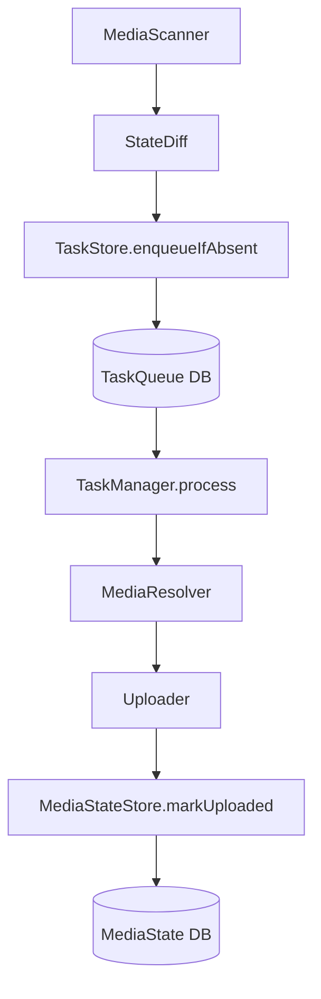

# media_watch_tasks

Flutter에서 **로컬 사진(Android/iOS) 신규 파일만 감지**하고, 업로드를 **Task Queue로 안전하게 관리**하기 위한 유틸리티 패키지입니다.

- **OS 실시간 이벤트 의존 없음**: 주기적 스캔 + DB 상태 비교
- **중복 업로드 방지**: `assetId` 기반(기본) + SHA-256 해시 기반(옵션)
- **백그라운드 안전 실행**: `background_fetch` 트리거 + DB 기반 재시도

## 아키텍처



## 설치

`pubspec.yaml`:

```yaml
dependencies:
  media_watch_tasks:
    path: ../media_watch_tasks
```

## 빠른 시작(권장 흐름)

### 1) 최초 실행: 기준점 설정(업로드 X)

최초 실행 시에는 기존 라이브러리를 전부 “seen”으로 기록하고, 이후부터 신규 사진만 감지하게 합니다.

```dart
final db = MediaWatchDatabase();

final taskManager = TaskManager(
  mediaScanner: PhotoManagerMediaScanner(),
  mediaResolver: PhotoManagerMediaResolver(),
  mediaStateStore: DriftMediaStateStore(db),
  taskStore: DriftTaskStore(db),
  uploader: MyUploader(),
);

await taskManager.initializeBaseline(); // 업로드/Task enqueue 없음
```

### 2) 이후 주기 실행: 스캔 → 큐 등록 → 처리

```dart
await taskManager.scanAndEnqueueNew();
await taskManager.process();
```

## Background Scheduler

기본 제공 스케줄러는 `background_fetch`를 사용합니다(플랫폼 제약에 따라 실행 빈도는 OS가 결정).

```dart
final scheduler = BackgroundFetchScheduler(
  onFetch: () async {
    await taskManager.scanAndEnqueueNew();
    await taskManager.process();
  },
);

await scheduler.start();
```

### iOS 제약

- iOS는 백그라운드 실행 빈도를 OS가 결정합니다.
- 사용자 사진 접근 권한이 필요합니다.
- “실시간 이벤트 기반” 방식 대신 **주기적 스캔 방식**이 정책적으로 안전합니다.

## 중복 방지 옵션(해시 기반)

기본은 `assetId`로 중복 방지합니다. 더 강한 중복 방지를 원하면 업로드 직전에 SHA-256 해시를 계산해 dedup할 수 있습니다.

```dart
final taskManager = TaskManager(
  // ...
  options: const TaskManagerOptions(enableHashDedup: true),
);
```

## 권한/플랫폼 설정(필수)

### iOS

`ios/Runner/Info.plist`에 추가:

- `NSPhotoLibraryUsageDescription`
- `NSPhotoLibraryAddUsageDescription` (필요 시)

### Android

Android 13+(API 33): `READ_MEDIA_IMAGES`
그 이하: `READ_EXTERNAL_STORAGE`

실제 설정은 앱의 `AndroidManifest.xml` / 런타임 권한 흐름에 맞게 구성하세요.

## Example 실행

```bash
cd example
flutter run
```

## 개발(Drift 코드 생성)

스키마 변경 시:

```bash
flutter pub run build_runner build --delete-conflicting-outputs
```

## 라이선스

MIT. 자세한 내용은 `LICENSE` 참고.
